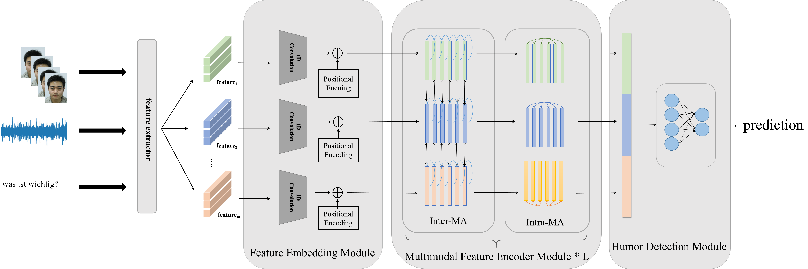

# JTMA-MuSe2023-Humor Detection

This is the source code for the paper

[JTMA: Joint Multimodal Feature Fusion and Temporal Multi-head Attention for Humor Detection.](https://doi.org/10.1145/3606039.3613112)  
Qi Li, Yangyang Xu, Zhuoer Zhao, Shulei Tang, Feixiang Zhang, Ruotong Wang, Xiao Sun, Meng Wang  
Proceedings of the 4th on Multimodal Sentiment Analysis Challenge and Workshop: Mimicked Emotions, Humour and Personalisation.  

## Environment

This code is based on Python3.8 and Pytorch 1.12. Other packages in `requirements.txt`.

## Features

For the multimodal features, please refer to [official support](https://www.muse-challenge.org/challenge/data). An extension of the visual features (VTP). Please put the extra features in the same directory as the official features.
The detail feature extractor for VPT referring to [this link](https://github.com/KMnP/vpt), APViT referring to [this link](https://github.com/youqingxiaozhua/APViT).

## Training
This code supports all the network structures and losses. You need to adjust the `config.BASE_PATH` and model save path `config.OUTPUT_PATH` in `config.py` and training parameters in `main.py` file. Then you can first run the `main.py` to train five models with different seeds, and then run the `late_fusion.py` file to fuse the results.

## Contact
If you have any problems or any further interesting ideas with this project, feel free to contact me (yangyangxu@mail.ustc.edu.cn or liqi@stu.ahu.edu.cn).

## If you use this work, please cite our paper

    @inproceedings{10.1145/3606039.3613112,
	author = {Li, Qi and Xu, Yangyang and Zhao, Zhuoer and Tang, Shulei and Zhang, Feixiang and Wang, Ruotong and Sun, Xiao and Wang, Meng},
	title = {JTMA: Joint Multimodal Feature Fusion and Temporal Multi-Head Attention for Humor Detection},
	year = {2023},
	publisher = {Association for Computing Machinery},
	booktitle = {Proceedings of the 4th on Multimodal Sentiment Analysis Challenge and Workshop: Mimicked Emotions, Humour and Personalisation},
	pages = {59–65},
	numpages = {7},
	series = {MuSe '23}
	}
